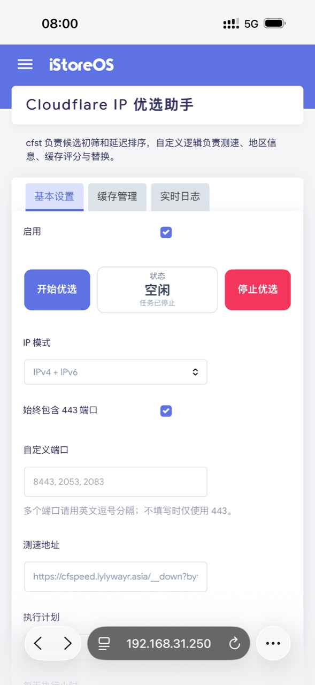
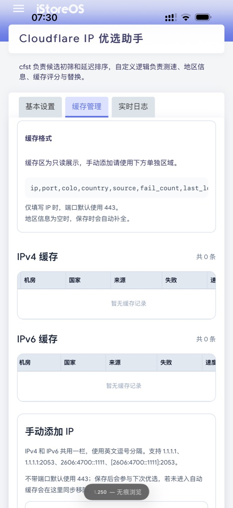
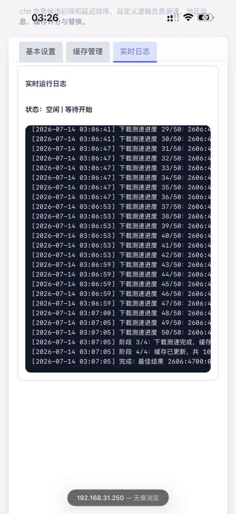

# OpenWrt Cloudflare IP 优选助手

[English](README.en.md)

面向 OpenWrt / iStoreOS 的 Cloudflare IP 优选方案。

包含两部分：

- `cf-ip-speed-client`
  使用 `cfst` 做候选初筛与延迟排序，再用自定义逻辑做下载测速、缓存管理、失败淘汰、手动补种、代理停启控制。
- `luci-app-cf-ip-speed-client`
  LuCI 面板，入口 `服务 -> Cloudflare IP 优选助手`。

当前仓库默认中文说明；英文说明见 [README.en.md](README.en.md)。

## 功能

- 支持 `IPv4`、`IPv6`、`IPv4 + IPv6`
- 支持多端口优选，`443` 可强制包含
- 支持自定义测速地址
- 候选 `50` 个、每个测速 `3` 次、线程数 `6`
- 结果前 `5` 展示
- 本地缓存池 `100` 条
- 失败次数累计淘汰
- 手动补种 IP
- 实时日志
- 优选前自动停止常见代理服务，结束后自动恢复
- 适配中国大陆网络环境

## 目录

```text
packages/
  cf-ip-speed-client/
  luci-app-cf-ip-speed-client/
packaging/
  cf-ip-speed-client/
  luci-app-cf-ip-speed-client/
scripts/
  build-release.ps1
  build-release.sh
docs/
install.sh
```

## 文档

- [如何自建测速地址](docs/self-hosted-speed-url.md)

## 截图

### 基本设置



### 缓存管理



### 实时日志



## 安装

### 方式 1：一键安装

适合 OpenWrt 23/24、iStoreOS、`opkg` 环境。

```sh
wget -qO- https://raw.githubusercontent.com/lylywayr/openwrt-cloudflare-ip-speed-helper/main/install.sh | sh
```

如果设备只有 `curl`：

```sh
curl -fsSL https://raw.githubusercontent.com/lylywayr/openwrt-cloudflare-ip-speed-helper/main/install.sh | sh
```

安装脚本会：

- 检查并安装依赖
- 自动安装 `cfst`
- 安装客户端与 LuCI 面板文件
- 保留已有配置并补齐缺省项
- 刷新 `rpcd`、`uhttpd`、`cron`

安装完成后进入：

```text
服务 -> Cloudflare IP 优选助手
```

### 方式 2：指定版本安装

先下载脚本，再指定 `REF`：

```sh
wget -O /tmp/cf-ip-speed-install.sh https://raw.githubusercontent.com/lylywayr/openwrt-cloudflare-ip-speed-helper/main/install.sh
REF=v0.2.1 sh /tmp/cf-ip-speed-install.sh
```

### 方式 3：离线安装 `.ipk`

仓库 Release 会附带通用 `all` 架构包：

- `cf-ip-speed-client_<version>_all.ipk`
- `luci-app-cf-ip-speed-client_<version>_all.ipk`

安装示例：

```sh
opkg install ./cf-ip-speed-client_0.2.1_all.ipk ./luci-app-cf-ip-speed-client_0.2.1_all.ipk
```

然后单独安装 `cfst`，或直接再跑一遍仓库里的 `install.sh`，让脚本补全依赖与 `cfst`。

## 升级

直接重新执行安装脚本即可：

```sh
wget -qO- https://raw.githubusercontent.com/lylywayr/openwrt-cloudflare-ip-speed-helper/main/install.sh | sh
```

安装脚本会先备份现有文件到：

```text
/tmp/cf-ip-speed-backup-时间戳
```

## 卸载

```sh
/etc/init.d/cf-ip-speed-client disable || true
rm -f /usr/bin/cf-ip-speed-client
rm -f /etc/init.d/cf-ip-speed-client
rm -f /etc/config/cf_ip_speed_client
rm -rf /etc/cf-ip-speed-client
rm -f /www/luci-static/resources/view/services/cf_ip_speed_client.js
rm -f /usr/share/rpcd/acl.d/luci-app-cf-ip-speed-client.json
rm -f /usr/share/luci/menu.d/luci-app-cf-ip-speed-client.json
rm -rf /tmp/luci-indexcache /tmp/luci-modulecache
/etc/init.d/rpcd restart
/etc/init.d/uhttpd restart
```

## 本地打包 Release

Windows:

```powershell
powershell -ExecutionPolicy Bypass -File .\scripts\build-release.ps1
```

Linux / macOS:

```sh
bash ./scripts/build-release.sh
```

输出目录：

```text
dist/
```

默认生成：

- `cf-ip-speed-client_0.2.1_all.ipk`
- `luci-app-cf-ip-speed-client_0.2.1_all.ipk`
- `install.sh`

## 注意

- 当前安装脚本主测 `opkg` 环境
- `cfst` 资源默认来自 [XIU2/CloudflareSpeedTest](https://github.com/XIU2/CloudflareSpeedTest)
- 若 `测速地址` 留空，脚本会回退到官方 `https://speed.cloudflare.com/__down?bytes=10485760`
- 这套逻辑默认会在优选时停止常见代理服务；请不要在关键业务时间段直接启动优选
- 首次安装后建议先检查 `测速地址`、`IP 模式`、`端口`、`执行计划`

## 常见问题

### 1. 页面更新了，但 LuCI 还是旧界面

清理 LuCI 缓存，或直接重启 `uhttpd`：

```sh
rm -rf /tmp/luci-indexcache /tmp/luci-modulecache
/etc/init.d/uhttpd restart
```

### 2. 为什么优选开始后代理会停掉

设计如此。优选测速要尽量走本机真实出口，否则测速结果会混入代理链路，失真。

### 3. 缓存为什么没有数据

常见原因：

- 刚装完还没跑过一轮
- 测试地址不可用
- `cfst` 不存在或执行失败
- 前端缓存未刷新

先看：

```sh
/usr/bin/cf-ip-speed-client show-status
/usr/bin/cf-ip-speed-client show-log
```

### 4. 手动添加的 IP 为什么又没了

手动添加只是加入下一轮候选。若测速不达标、未进入自动缓存，会被同步清掉。这是当前设计。

### 5. 多端口没有生效怎么办

检查：

- `始终包含 443 端口` 是否开启
- `自定义端口` 是否用英文逗号分隔
- 当前 `测速地址` 是否允许这些端口

### 6. 如何只升级面板和脚本，不重装整机

直接重跑安装脚本即可：

```sh
wget -qO- https://raw.githubusercontent.com/lylywayr/openwrt-cloudflare-ip-speed-helper/main/install.sh | sh
```

### 7. 适合哪些系统

当前主测：

- iStoreOS
- OpenWrt 23 / 24
- `opkg` 环境

其他发行版可参考仓库源码手动落文件。

## 许可证

[MIT](LICENSE)
